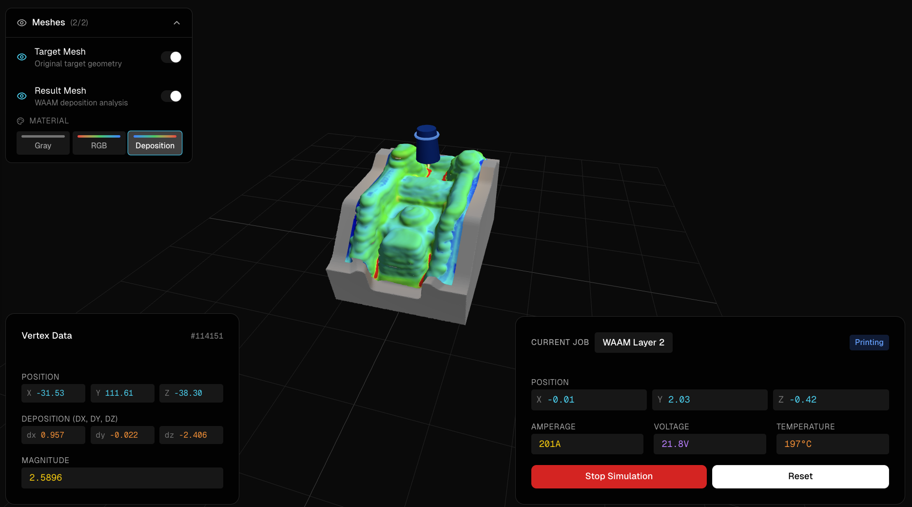

# WAAM Robot Status Monitor

A 3D visualization tool for Wire Arc Additive Manufacturing (WAAM) robot monitoring and mesh analysis with real-time telemetry simulation.



## Tech Stack

- **Framework**: [Next.js 16](https://nextjs.org/) (App Router, Turbopack)
- **3D Rendering**: [React Three Fiber](https://r3f.docs.pmnd.rs/) + [Three.js](https://threejs.org/)
- **Helpers**: [@react-three/drei](https://drei.docs.pmnd.rs/)
- **State Management**: [Redux Toolkit](https://redux-toolkit.js.org/)
- **UI Components**: [Shadcn/ui](https://ui.shadcn.com/) + [Radix](https://www.radix-ui.com/)
- **Styling**: [Tailwind CSS v4](https://tailwindcss.com/)
- **Language**: TypeScript

## Getting Started

### Prerequisites

- Node.js 20+ 
- pnpm (recommended) or npm

### Installation

```bash
# Clone the repository
git clone <repo-url>
cd interview-template

# Install dependencies
pnpm install

# Start development server
pnpm dev
```

Open [http://localhost:3000/canvas](http://localhost:3000/canvas) to view the application.

### Available Scripts

| Command | Description |
|---------|-------------|
| `pnpm dev` | Start development server with Turbopack |
| `pnpm build` | Create production build |
| `pnpm start` | Start production server |
| `pnpm lint` | Run ESLint |

## Features

- **3D Mesh Visualization**: View target and result meshes with toggleable visibility
- **Material Modes**: Switch between Gray, RGB vertex colors, and Deposition heatmap
- **Vertex Inspector**: Hover over mesh to see per-vertex data (RGB or deposition values)
- **Robot Simulation**: Real-time telemetry updates with position, amperage, voltage, and temperature
- **Status Indication**: Color-coded robot status (idle/printing/paused/error)

---

## PLY to GLB Workflow

This section documents how to prepare mesh data from PLY format for use in the application.

### PLY File Requirements

The PLY file should contain the following vertex properties:

```
property float x
property float y
property float z
property float nx        # normal x
property float ny        # normal y
property float nz        # normal z
property float dx        # deposition delta x
property float dy        # deposition delta y
property float dz        # deposition delta z
property uchar red       # RGB color (0-255)
property uchar green
property uchar blue
```

### Blender Import

1. Open Blender and import your PLY file: **File > Import > Stanford (.ply)**
2. The mesh will import with vertex colors and custom attributes

### Critical: Attribute Naming

GLTF/GLB format requires custom vertex attributes to be **prefixed with an underscore** (`_`). 

Before exporting, rename your custom attributes in Blender's Geometry Nodes or via Python:

| Original Name | Required GLB Name |
|---------------|-------------------|
| `dx` | `_dx` |
| `dy` | `_dy` |
| `dz` | `_dz` |

**To rename attributes in Blender:**

1. Go to **Geometry Nodes** workspace
2. Create a node setup that captures and stores attributes with new names
3. Or use Python script:

```python
import bpy

obj = bpy.context.active_object
mesh = obj.data

# Rename attributes
for attr in mesh.attributes:
    if attr.name in ['dx', 'dy', 'dz']:
        attr.name = '_' + attr.name
```

### GLTF Export Settings

Export via **File > Export > glTF 2.0 (.glb/.gltf)**

**Critical settings:**

| Category | Setting | Value |
|----------|---------|-------|
| Include | Custom Properties | ✓ Enabled |
| Data > Mesh | **Attributes** | ✓ **Enabled** |
| Compression | Draco | Optional (works with or without) |

> **Important**: The "Attributes" checkbox under **Data > Mesh** is essential for preserving custom vertex attributes like `_dx`, `_dy`, `_dz`.

### Verification

After export, you can verify attributes are present by inspecting the GLB in the browser console:

```javascript
// In browser dev tools after loading the scene
const geometry = scene.children[0].geometry;
console.log(Object.keys(geometry.attributes));
// Should include: position, normal, color, _dx, _dy, _dz
```

### Placing the GLB

Place your exported `.glb` file in the `public/meshes/` directory:

```
public/
  meshes/
    draco_prefix_meshattr.glb
```

Reference it in code via public URL: `/meshes/draco_prefix_meshattr.glb`

---

## Project Structure

```
├── app/
│   ├── canvas/
│   │   └── page.tsx        # Main 3D canvas page
│   ├── globals.css         # Global styles
│   └── layout.tsx          # Root layout
├── components/
│   ├── deviation-material.tsx    # Deposition heatmap shader
│   ├── mesh-visibility-panel.tsx # Mesh toggle controls
│   ├── meshes.tsx         # GLTF mesh loader
│   ├── rgb-material.tsx          # RGB vertex color shader
│   ├── robot-status-panel.tsx    # Telemetry display
│   ├── robot-tool-head.tsx       # 3D robot model
│   ├── vertex-info-panel.tsx     # Hover tooltip
│   └── ui/                       # Shadcn components
├── hooks/
│   └── use-robot-simulation.ts   # Telemetry simulation
├── lib/
│   ├── store.ts            # Redux store + slices
│   ├── store-provider.tsx  # Redux provider
│   ├── hooks.ts            # Typed Redux hooks
│   └── utils.ts            # Utility functions
└── public/
    └── meshes/             # GLB model files
```

## Adding New Sensor Data

To add new vertex attributes (e.g., temperature):

1. **Add attribute to PLY** with underscore prefix (`_temperature`)
2. **Create shader** in `components/` that reads the attribute
3. **Add material mode** to `mesh-visibility-panel.tsx`
4. **Update vertex info panel** to display the new data on hover
